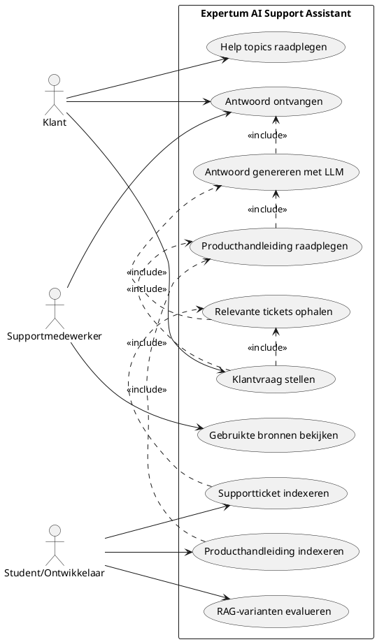

# Use Case Diagram

Onderstaand diagram toont de belangrijkste interacties met de Expertum AI Support Assistant.

## Korte uitleg

De klant gebruikt de applicatie om een supportvraag te stellen en een antwoord te ontvangen. De AI-assistent zoekt daarbij relevante informatie op uit twee kennisbronnen: historische supporttickets en producthandleidingen. Daarna genereert het lokale LLM een klantgericht antwoord.

De supportmedewerker of demonstrator kan de gebruikte bronnen bekijken om te controleren waarop het antwoord gebaseerd is. De student of ontwikkelaar beheert de technische kant van de proof-of-concept: tickets indexeren, handleidingen indexeren en evaluatietesten uitvoeren met verschillende RAG-varianten.

## Actoren

- **Klant**: stelt een vraag en ontvangt een antwoord.
- **Supportmedewerker**: bekijkt het gegenereerde antwoord en de opgehaalde bronnen.
- **Student/Ontwikkelaar**: bouwt en onderhoudt de indexen en voert evaluaties uit.

## Belangrijkste use cases

- **Klantvraag stellen**: de klant voert een vraag in via de webinterface.
- **Relevante tickets ophalen**: het systeem zoekt historische tickets met Chroma en LangChain.
- **Producthandleiding raadplegen**: bij technische vragen zoekt het systeem ook in producthandleidingen.
- **Antwoord genereren met LLM**: LLaMA 3.1 8B genereert een antwoord op basis van de opgehaalde context.
- **Gebruikte bronnen bekijken**: de gebruiker kan controleren welke tickets of handleidingfragmenten gebruikt werden.
- **RAG-varianten evalueren**: de student vergelijkt antwoorden met alleen tickets, alleen handleidingen en de hybride aanpak.

